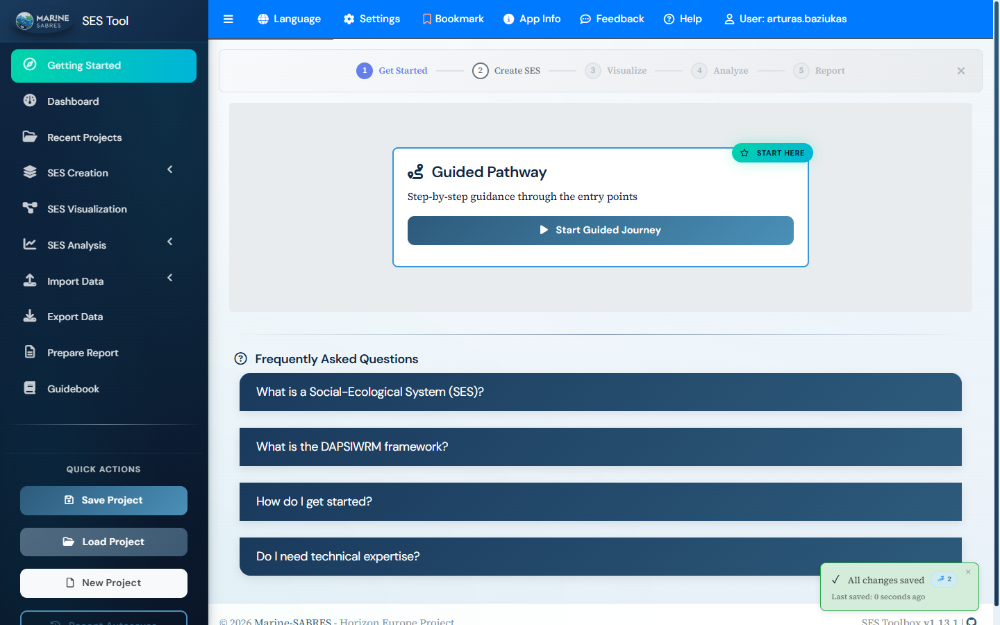
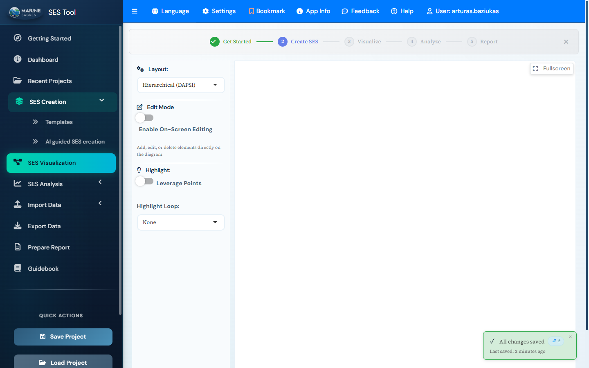
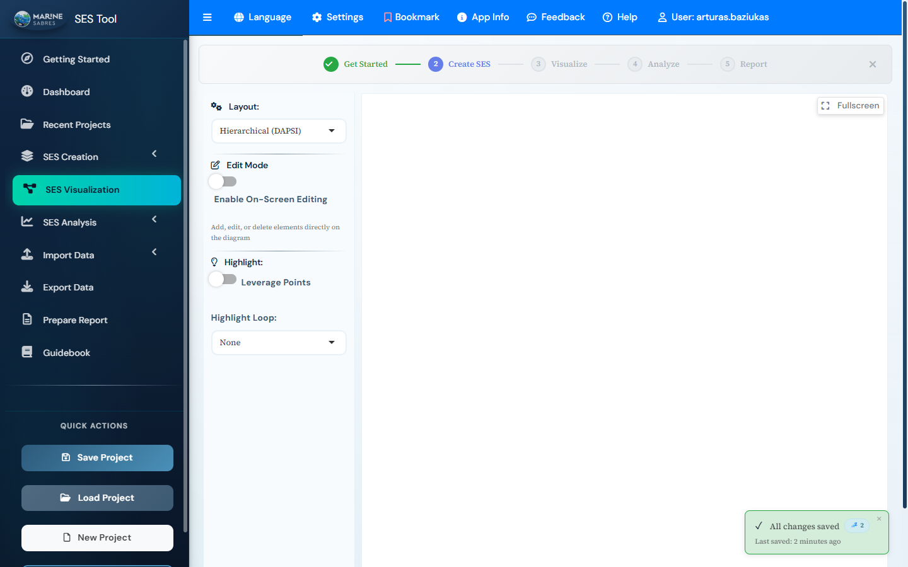

# MarineSABRES SES Toolbox

[](https://www.r-project.org/)
[](https://bs4dash.rinterface.com/)
[](LICENSE)
[](translations/)

A comprehensive Shiny application for Social-Ecological Systems (SES) analysis and visualization, developed as part of the [Marine-SABRES](https://marinesabres.eu/) Horizon Europe project.

**Live deployment**: [laguna.ku.lt/marinesabres](https://laguna.ku.lt/marinesabres/)

---

## Screenshots

### Home Page - Guided Workflow

*Choose between a guided step-by-step journey or quick access to specific tools*

### Network Visualization

*Interactive Causal Loop Diagram with DAPSI(W)R(M) elements, edit mode, and auto-save*

### Layout Controls

*Customize network layout with hierarchical views, spacing, and horizontal spread options*

---

## Overview

The MarineSABRES SES Toolbox enables researchers, policymakers, and stakeholders to model and analyze marine social-ecological systems using the **DAPSI(W)R(M)** framework:

| Component | Description |
|-----------|-------------|
| **D**rivers | Root causes driving human activities (e.g., food security, economic growth) |
| **A**ctivities | Human actions affecting the environment (e.g., fishing, tourism) |
| **P**ressures | Environmental stressors from activities |
| **S**tate Changes | Ecosystem state modifications |
| **I**mpacts | Effects on ecosystem services |
| **(W)**elfare | Human wellbeing outcomes |
| **R**esponses | Policy and management interventions |
| **(M)**easures | Implementation actions |

### Key Capabilities

- **Build SES models** from scratch or use pre-configured templates
- **Visualize causal relationships** through interactive Causal Loop Diagrams
- **Analyze system dynamics** — network metrics, feedback loops, leverage points
- **Design response measures** and evaluate intervention scenarios
- **Generate reports** in HTML, Word, PowerPoint, and PDF formats
- **9-language support**: English, Spanish, French, German, Lithuanian, Portuguese, Italian, Norwegian, Greek

---

## Features

### SES Creation Options

| Method | Description |
|--------|-------------|
| **AI-Guided** | Intelligent assistant suggests elements and connections |
| **Template-Based** | 7 pre-built templates (Fisheries, Tourism, Aquaculture, Pollution, Climate, Caribbean, Offshore Wind) |
| **Graphical Builder** | Point-and-click diagram creation |
| **ISA Data Entry** | Structured matrix-based input |
| **Excel Import** | Load existing models from spreadsheets |

### Analysis Tools

| Tool | Description | Exports |
|------|-------------|---------|
| **Network Metrics** | Degree, betweenness, closeness, eigenvector centrality, PageRank | Excel, PNG |
| **Feedback Loops** | Detect and classify reinforcing/balancing loops with dominance analysis | Excel, Word |
| **Leverage Points** | Composite scoring to identify key intervention nodes | Excel, PNG |
| **Boolean Stability** | Attractor analysis for system state stability | CSV |
| **BOT Analysis** | Boundaries of Tipping points assessment | CSV |
| **Scenario Builder** | Test response measures and evaluate outcomes | — |
| **Network Simplification** | Reduce complexity while preserving key dynamics | — |
| **Intervention Analysis** | Model targeted interventions on specific nodes | — |

### User Experience

- **Workflow Stepper** — Visual progress indicator (Get Started → Create SES → Visualize → Analyze → Report)
- **Experience Levels** — Beginner, Intermediate, Expert modes
- **Auto-Save** — Changes saved automatically with version history
- **Context-Sensitive Help** — Integrated guidance throughout the application
- **Responsive Design** — Works on desktop and tablet devices

---

## Quick Start

### Prerequisites

- **R** >= 4.4.1
- **RStudio** (recommended) or any R environment

### Installation

```r
# Install core packages
install.packages(c(
  "shiny", "bs4Dash", "shinyWidgets", "shinyjs", "shinyBS",
  "shiny.i18n", "DT", "jsonlite", "openxlsx", "readxl",
  "igraph", "visNetwork", "ggplot2", "plotly",
  "dplyr", "tidyr", "purrr", "stringr", "lubridate",
  "htmltools", "htmlwidgets", "rmarkdown", "knitr",
  "officer", "flextable", "tinytex"
))

# Install TinyTeX for PDF export (optional)
tinytex::install_tinytex()
```

### Running the Application

```r
# From the project directory
shiny::runApp()
```

The application opens at `http://127.0.0.1:3838`.

---

## Project Structure

```
MarineSABRES_SES_Shiny/
├── app.R                       # Main entry point
├── global.R                    # Package loading, startup
├── constants.R                 # Configuration constants
├── modules/                    # 44 Shiny modules
│   ├── isa_data_entry_module.R
│   ├── cld_visualization_module.R
│   ├── analysis_*.R            # Analysis modules
│   └── ...
├── functions/                  # Helper functions
│   ├── data_structure.R
│   ├── network_analysis.R
│   ├── ml_*.R                  # ML classification
│   └── ...
├── server/                     # Server handlers
├── translations/               # 9 languages, 38 JSON files
│   ├── common/
│   ├── modules/
│   └── ui/
├── data/                       # SES templates
├── www/                        # Static assets
├── tests/                      # Test suite (55 test files, 3700+ tests)
└── deployment/                 # Deployment scripts
```

---

## Deployment

### Remote Server (Production)

```powershell
# Windows (PowerShell)
.\deployment\deploy-remote.ps1 -DryRun    # Preview
.\deployment\deploy-remote.ps1             # Deploy
```

```bash
# Linux/Mac
bash deployment/remote-deploy.sh --dry-run
bash deployment/remote-deploy.sh
```

**Target**: `razinka@laguna.ku.lt:/srv/shiny-server/marinesabres/`

### Docker

```bash
docker build -f deployment/Dockerfile -t marinesabres .
docker run -p 3838:3838 marinesabres
```

See [deployment/REMOTE_DEPLOYMENT_README.md](deployment/REMOTE_DEPLOYMENT_README.md) for full instructions.

---

## Development

### Running Tests

```r
# All tests
Rscript tests/run_all_tests.R

# testthat only
Rscript -e "testthat::test_dir('tests/testthat')"

# Specific test file
Rscript -e "testthat::test_file('tests/testthat/test-network-analysis.R')"
```

### Code Conventions

- Constants in `constants.R`, not scattered across files
- `debug_log(msg, context)` for logging (not `cat()` or `print()`)
- All user-facing strings use `i18n$t()` keys
- Module pattern: `module_name_ui()` + `module_name_server()`

### Documentation

| Document | Description |
|----------|-------------|
| [CLAUDE.md](CLAUDE.md) | Development guide and conventions |
| [CONTRIBUTING.md](CONTRIBUTING.md) | Contribution guidelines |
| [DAPSIWRM_FRAMEWORK_RULES.md](Documents/DAPSIWRM_FRAMEWORK_RULES.md) | Framework connection rules |
| [ML_ARCHITECTURE.md](Documents/ML_ARCHITECTURE.md) | ML system documentation |
| [MODULE_SIGNATURE_STANDARD.md](Documents/MODULE_SIGNATURE_STANDARD.md) | Module conventions |

---

## Version History

| Version | Date | Highlights |
|---------|------|------------|
| **1.8.1** | 2026-03-15 | Codebase audit: 12 bug fixes, dead code removal, test strengthening |
| **1.8.0** | 2026-03-15 | Knowledge base validation, country governance, graphical builder |
| 1.7.0 | 2026-03-14 | Security hardening, DTU integration, accessibility, Norwegian/Greek |
| 1.6.1 | 2026-01 | Stability fixes, constants consolidation, i18n completion |
| 1.6.0 | 2025-12 | Modular translations, AI ISA assistant, deployment framework |
| 1.5.x | 2025-11 | Template system, Caribbean template, multi-language support |

See [CHANGELOG.md](CHANGELOG.md) for detailed release notes.

---

## Acknowledgments

This project is developed as part of **Marine-SABRES** (Marine Systems Approaches for Biodiversity Resilient European Seas), funded by the European Union's Horizon Europe research and innovation programme under Grant Agreement No. 101136352.

<p align="center">
  <a href="https://marinesabres.eu/">
    
  </a>
</p>

---

## Links

- **Repository**: [github.com/razinkele/SESTool](https://github.com/razinkele/SESTool)
- **Live App**: [laguna.ku.lt/marinesabres](https://laguna.ku.lt/marinesabres/)
- **Marine-SABRES Project**: [marinesabres.eu](https://marinesabres.eu/)
