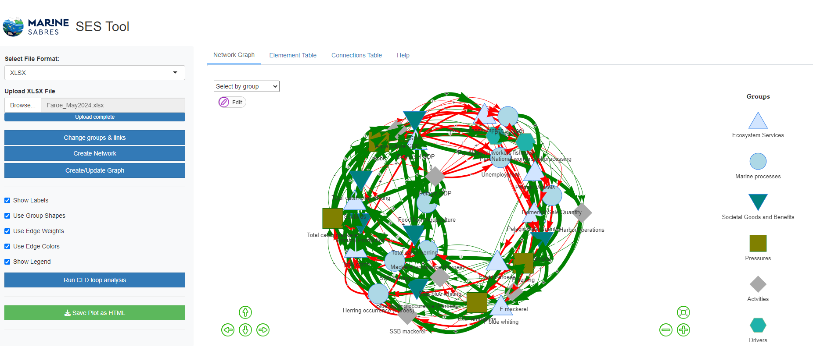

# SESTool

Frontend for the SES toolbox created for the MarineSABRES project

<<<<<<< HEAD
The Frontend is build in object oriented R using the R6 class system. The front end expected to run as ShinyApp and use VisNetwork as a main visualisation tool. So far the tool could read Excel files imported from KUMU and display networks using the VisNetworks library

](images/clipboard-1675788375.png)
=======
# 

The Frontend is build in object oriented R using the R6 class system. The front end expected to run as ShinyApp and use VisNetwork as a main visualisation tool. So far the tool could read Excel files imported from KUMU and display networks.
>>>>>>> 7bcae1496b9d01a8a06353586165509dd4b5cd0b

So far the tool has two R code files:

**classes.R** - implementation of SES class using R6 class system

**SESTool_ver0.x.R** actual ShinyApp application which could run

**data** subdirectory contains data files in MSExcel data format , where ***first sheet*** should contain two columns containing "from" and "to" element(names) constituting the links (edges). Other columns should have 'width', 'strength' or 'value' variable, which is used to represent positive or negative relation between two elements (nodes). In case the Excel file is an export from KUMU the 'strength' column have character (semi-quantitative) values from "Strong negative" to 'Strong positive' which are to be recoded in the numerical values. The first sheet ultimately should contain the "confidence" column.

***Second sheet*** (if present) should contain element (node) names as a first column followed by other attributes including the group variable which represent the element (node) group (Actvity, Driver, Ecosystem Service, Good and Benefit, Pressure or Marine Process and Function) which otherwise should be assingned to each of the elements (nodes) to display the network with a variety of icons corresponding the group.
