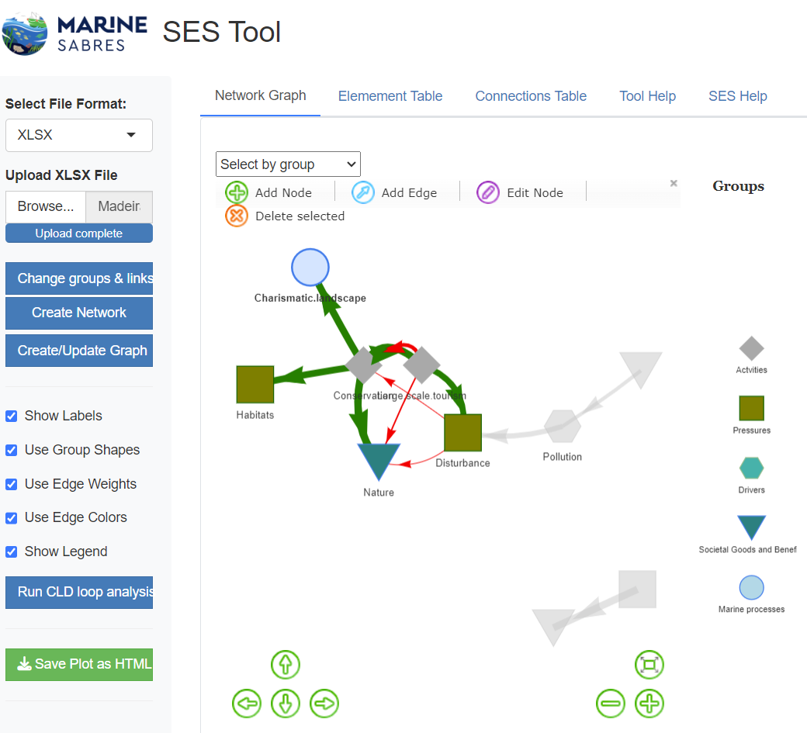

# MarineSABRES SES Tool*.*

## Purpose:

*MarineSABRES SES Tool is an on-line DST focused on the construction, visualisation and analysis of Socio-Ecological Systems .*

## Loading SES network from file:

Tool could read connections(edges) and elements(nodes) needed for SES network construction prepared or exported (KUMU) in Excel MSExcel data format , where ***first sheet*** should contain two columns containing "from" and "to" element(names) constituting the links (edges). Other columns should have 'width', 'strength' or 'value' variable, which is used to represent positive or negative relation between two elements (nodes). In case the Excel file is an export from KUMU the 'strength' column have character (semi-quantitative) values from "Strong negative" to 'Strong positive' which are to be recoded in the numerical values. The first sheet ultimately should contain the "confidence" column.

***Second sheet*** (if present) should contain element (node) names as a first column followed by other attributes including the group variable which represent the element (node) group (Actvity, Driver, Ecosystem Service, Good and Benefit, Pressure or Marine Process and Function) which otherwise should be assingned to each of the elements (nodes) to display the network with a variety of icons corresponding the group.

## Definitions:

| Term | Definition |
|------------------------------------|------------------------------------|
| Socio-Ecological System | Causal Loop Diagrams are rooted in systems thinking and are designed to visually represent the intricate interrelations between system variables (Senge, 1990). |
| Connection | A connection represents a causal relationship between two elements within the system. It indicates that a change in one element (the cause) will lead to a change in another (the effect), based on available evidence or expert judgement. |
| Connection Strength | Refers to the intensity of influence that one element has on another within the system, based on available evidence or expert judgement. |
| Confidence | Confidence represents the level of certainty in the identified connection between two elements, based on available evidence or expert judgement. |
| Node | An element is a representation of an indicator which is a variable that is liable to vary or change. |
| Negative Edge | A negative edge represents an inverse relationship between two elements, where an increase in the cause leads to a decrease in the effect. This edge is represented by a red line between two nodes. |
| Positive Edge | A positive edge indicates a direct relationship between two elements, where an increase in the cause leads to an increase in the effect (or a decrease leads to a decrease). This edge is represented by a blue line between two nodes. |
|  |  |
|  |  |
|  |  |

## Editing elements (nodes) and links(edges)

SES Tool could be used to edit or modify SES network by deleting or adding elements and links or modifying their values

